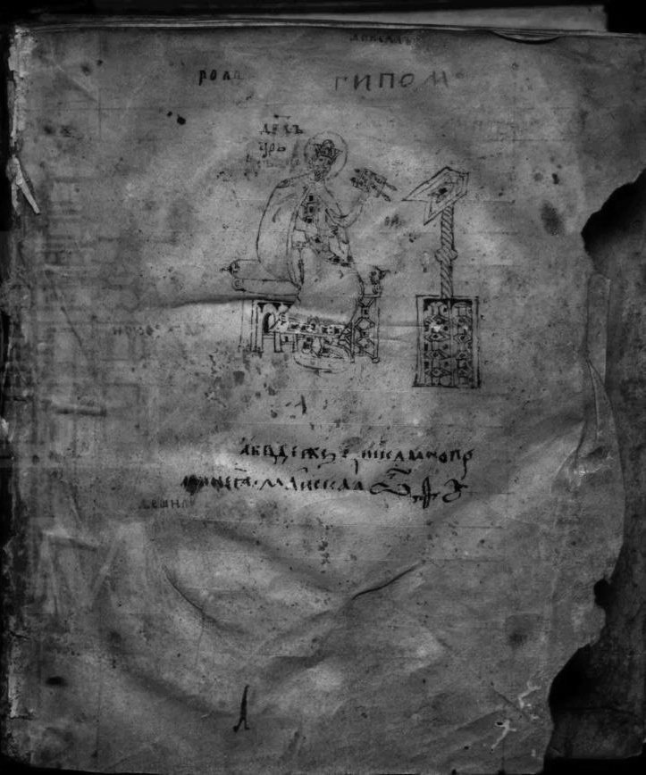
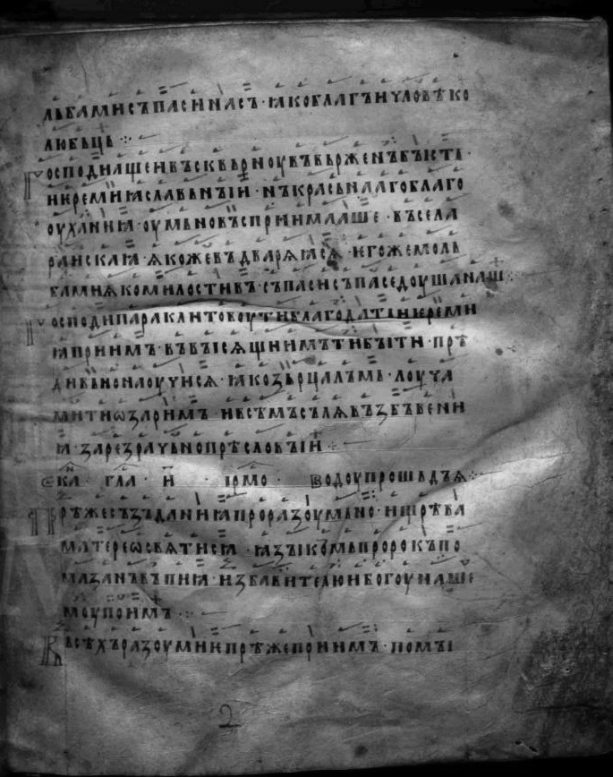
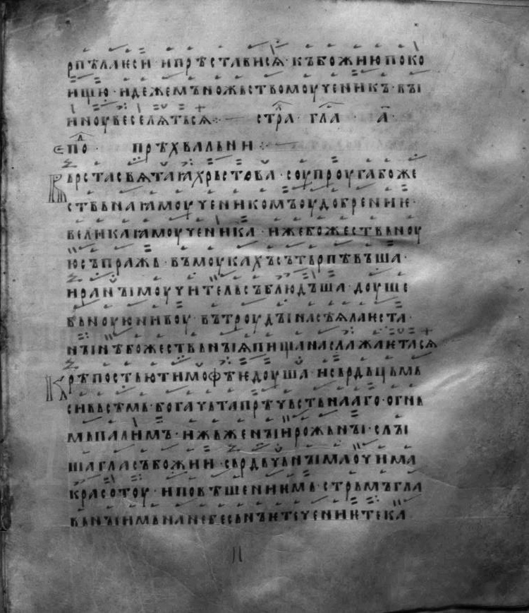
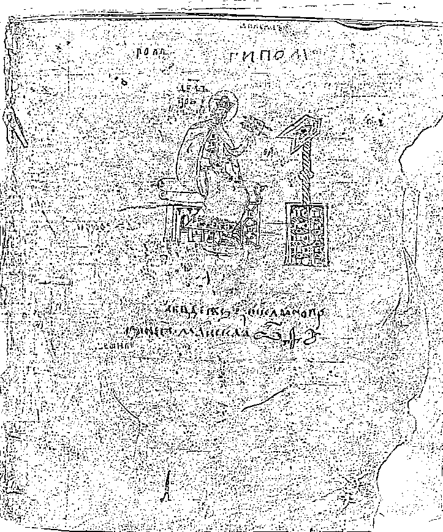
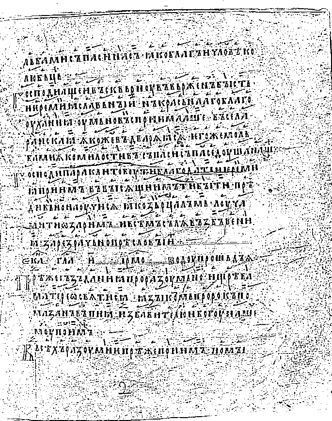
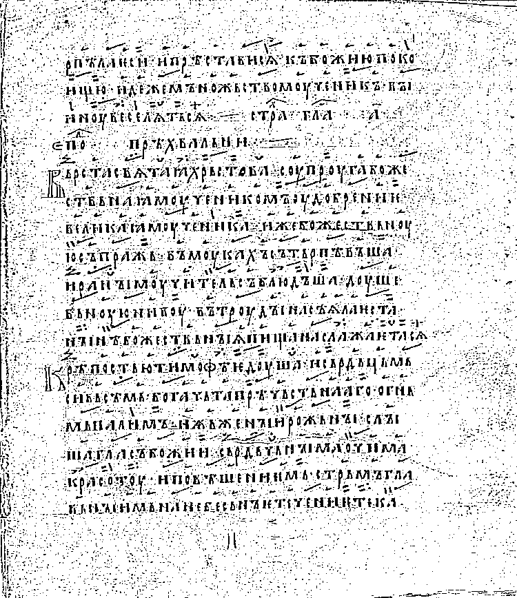

# Лабораторная работа №2 (вариант 14)

## Обесцвечивание и бинаризация растровых изображений

## Описание

В данной работе реализованы две операции над растровыми изображениями без использования библиотечных функций перевода в полутон и бинаризации:

1. Приведение полноцветного изображения к полутоновому  
   Полутоновое изображение создаётся вручную по формуле взвешенного усреднения каналов:

   `Y = 0.299R + 0.587G + 0.114B`

2. Приведение полутонового изображения к монохромному  
   Используется адаптивное монохромное преобразование с усреднением по окну **5×5**:

   `T(x,y) = mean(window 5×5) - offset`  
   если `Y(x,y) >= T(x,y)` → 255, иначе → 0.

## Установка

```powershell
python -m pip install -r requirements.txt
```

## Исходные изображения

В качестве исходных изображений используются полноцветные трёхканальные изображения, получаемые через «API» сайта:

`https://www.slavcorpora.ru/manuscripts/856066a1-8663-4e31-9fbf-b740ab965c8c/images/1`

Количество изображений (LIMIT) задаётся параметром `--limit`:

```powershell
python .\lab2.py --download-slavcorpora "https://www.slavcorpora.ru/manuscripts/856066a1-8663-4e31-9fbf-b740ab965c8c/images/1" --limit 3
```

Важно: на сайте изображения в формате JPEG, поэтому для соблюдения требований лабораторной они сохраняются локально в `input/` как PNG.

| Исходное изображение 1 | Исходное изображение 2 | Исходное изображение 3 |
|---|---|---|
|  |  |  |

## Приведение изображения к полутону

Полутоновое изображение строится вручную по формуле взвешенного усреднения каналов:

`Y = 0.299R + 0.587G + 0.114B`

Команда:

```powershell
python .\lab2.py --window 5 --offset 5 --export-previews
```

| Полутоновое изображение 1 | Полутоновое изображение 2 | Полутоновое изображение 3 |
|---|---|---|
|  |  |  |

## Бинаризация полутонового изображения

Для бинаризации используется адаптивная пороговая обработка с усреднением по окну 5×5:

```text
WINDOW_SIZE = 5
offset = 5
```

Параметр `offset` подбирается экспериментально под конкретное изображение.

| Бинаризация 1 | Бинаризация 2 | Бинаризация 3 |
|---|---|---|
|  |  |  |

Также сохраняется сравнение (оригинал | полутон | бинарное): `output/*_compare.png`.
