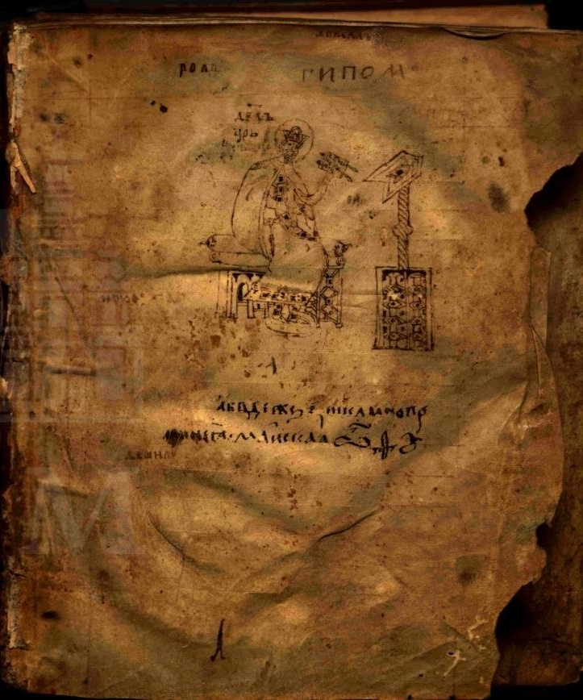
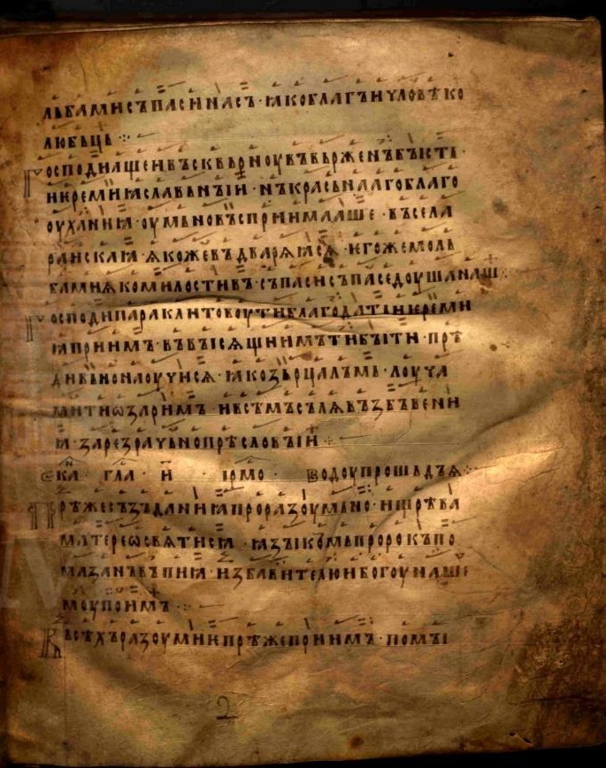
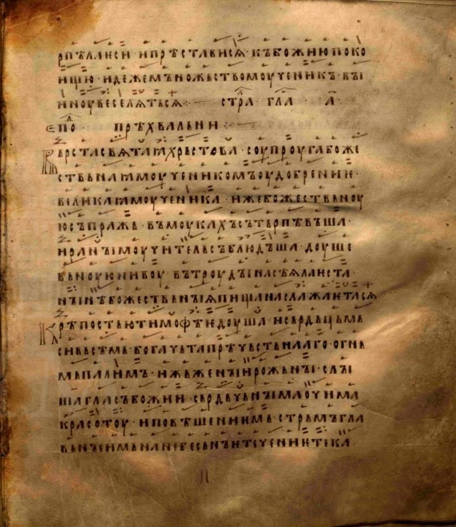
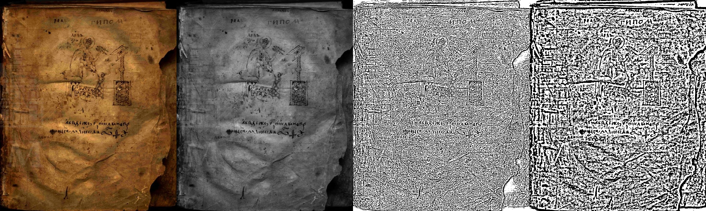
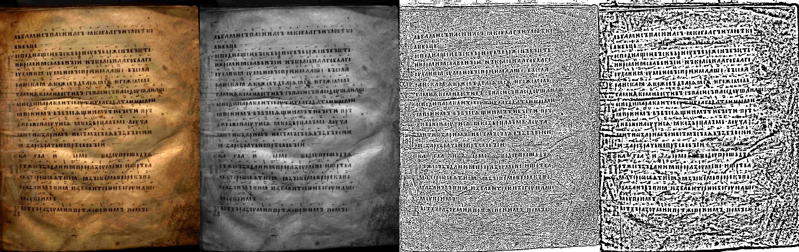
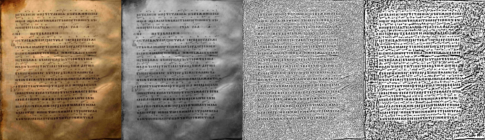

# Лабораторная работа №2. Обесцвечивание и бинаризация растровых изображений

Вариант: адаптивная бинаризация по локальному среднему (окна 5×5 и 15×15).

В работе реализованы две операции над растровыми изображениями **без использования библиотечных функций** перевода в полутон и бинаризации:

1. Приведение полноцветного (RGB) изображения к полутоновому (1 яркостный канал, формат `BMP`).
2. Приведение полутонового изображения к монохромному методом **адаптивной пороговой обработки** (локальный порог = среднее по окну).

## 1) Приведение к полутону

Яркость пикселя вычисляется вручную взвешенным усреднением каналов:

`Y = 0.299R + 0.587G + 0.114B`

Результат сохраняется как 8-bit grayscale `BMP` (`*_gray.bmp`).

## 2) Бинаризация (адаптивный порог по среднему)

Локальный порог для пикселя `(x, y)`:

`T(x,y) = mean(window) - offset`

Далее:

- если `Y(x,y) >= T(x,y)` → `255`
- иначе → `0`

По заданию демонстрируются окна **5×5** и **15×15** (файлы `*_bin_w5.bmp` и `*_bin_w15.bmp`).

## Установка

```powershell
python -m pip install -r requirements.txt
```

## Исходные изображения

Скрипт работает с полноцветными трёхканальными `.png/.bmp` (не `.jpg`) в папке `input/`.

Дополнительно можно скачать примеры из slavcorpora (на сайте исходники JPEG, но скрипт сохраняет их в `input/` как PNG):

```powershell
python .\lab2.py --download-slavcorpora "https://www.slavcorpora.ru/manuscripts/856066a1-8663-4e31-9fbf-b740ab965c8c/images/1" --limit 3
```

| Исходное изображение 1 | Исходное изображение 2 | Исходное изображение 3 |
|---|---|---|
|  |  |  |

## Запуск

Сгенерировать набор разных типов изображений (контурная карта, «рентген», мультфильм, «фото», отпечаток, неравномерно засвеченный текст):

```powershell
python .\lab2.py --generate-samples
```

Запустить обработку для окон 5×5 и 15×15 (и экспортировать PNG-превью для Markdown):

```powershell
python .\lab2.py --windows 5,15 --offset 0 --export-previews
```

## Результаты

Для каждого изображения сохраняется склейка: `оригинал | полутон | бинаризация 5×5 | бинаризация 15×15`:

- `output/*_compare.png`

### Демонстрация (несколько типов изображений)

- Контурная карта: `output/sample_contours_compare.png`
- Рентгеновский снимок: `output/sample_xray_compare.png`
- Скриншот из мультфильма: `output/sample_cartoon_compare.png`
- Фотография: `output/sample_photo_compare.png`
- Отпечаток пальца: `output/sample_fingerprint_compare.png`
- Неравномерно засвеченная страница текста: `output/sample_text_uneven_compare.png`

### Пример рукописей (до/после)

| 1 | 2 | 3 |
|---|---|---|
|  |  |  |
